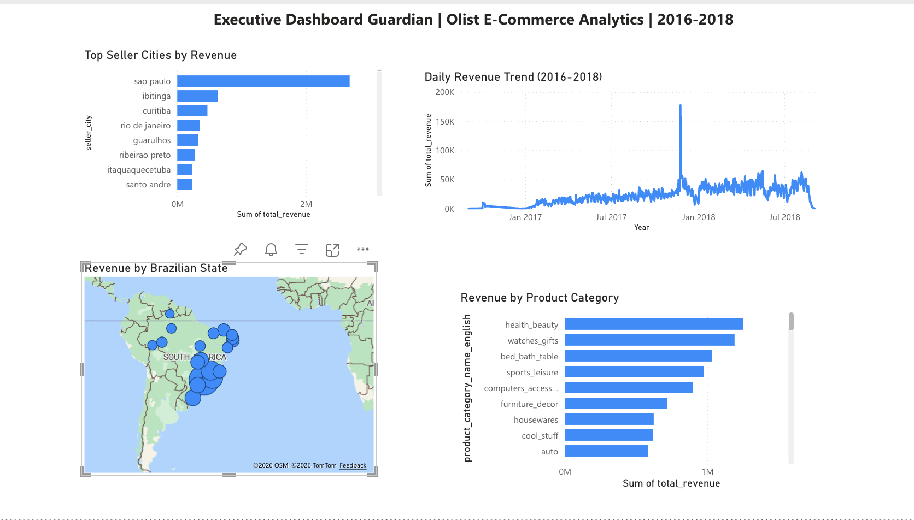

# Executive Dashboard Guardian

A continuous data quality monitoring platform that gives data teams instant visibility into pipeline health — so they can fix issues BEFORE executives make decisions on broken data.

## The Problem

Without monitoring, data teams find out about quality issues from angry executives. By then, wrong decisions have already been made based on bad data.

Real failure modes that this platform detects:
- A pipeline fails silently → revenue appears to drop 90% overnight
- Duplicate orders get loaded → revenue is inflated by $500K
- A critical field goes NULL → average order value shows $0
- Data feed goes stale → executives see yesterday's numbers thinking it's live

**Executive Dashboard Guardian provides continuous monitoring across the entire pipeline** — detecting violations the moment they occur and logging them to a queryable Delta table for instant investigation.

---

## The Solution

Think of it like:
- **Datadog** monitors servers
- **Sentry** monitors application errors
- **Guardian** monitors data quality

It's an observability platform for data pipelines.

---

## Architecture

```
[ Kaggle Olist CSVs ]
         │
         ▼
┌─────────────────┐
│  BRONZE LAYER   │  Raw ingestion + schema drift detection + audit log
└────────┬────────┘
         │
         ▼
┌─────────────────┐
│ QUALITY ENGINE  │  21 automated checks — the GUARDIAN!
│ (MONITORING)    │  Duplicates, Nulls, Staleness, Volume, Anomalies
└────────┬────────┘
         │
         ▼
┌─────────────────┐
│  SILVER LAYER   │  Cleaned, typed, trusted data
└────────┬────────┘
         │
         ▼
┌─────────────────┐
│  GOLD LAYER     │  Business KPIs and aggregations
└────────┬────────┘
         │
         ▼
[ Power BI Executive Dashboard ]
```

---

## Tech Stack

| Tool | Purpose |
|---|---|
| Python 3.10+ | Pipeline code and validators |
| PySpark 3.5 | Distributed data processing |
| Delta Lake 3.1 | ACID transactions, time travel, schema enforcement |
| Power BI | Executive dashboard layer |
| Loguru | Structured logging |
| pytest | Unit and integration tests |

---

## Dataset

[Olist Brazilian E-Commerce Dataset](https://www.kaggle.com/datasets/olistbr/brazilian-ecommerce) from Kaggle — 1.5M+ records across 8 related tables.

---

## Data Quality Monitoring — 21 Automated Checks

| Check | What It Monitors |
|---|---|
| Duplicate Check | Detects duplicate records via MD5 row hashing |
| Null Check | Monitors critical fields for unexpected nulls |
| Staleness Check | Detects data feeds that haven't refreshed |
| Volume Check | Detects unexpected row count drops |
| Revenue Anomaly Check | Statistical outlier detection via Z-score |

All violations are written to a queryable Delta table (`dq_violations`) so data teams can investigate and prioritize issues immediately.

---

## Live Demo — Before and After Monitoring

This project includes a live demonstration of why monitoring matters.

### Without Guardian Monitoring:

When bad data enters the pipeline (142 duplicate orders + 89 null payment values were injected via `simulate_bad_data.py`):
- The dashboard breaks mysteriously
- Charts display "Something's wrong with one or more fields"
- The data team has NO idea what went wrong
- Hours wasted investigating

### With Guardian Monitoring:

Running `run_quality_checks.py` after the bad data injection:
```
× duplicate_check        FAILED  (1 violation)
× null_check             FAILED  (1 violation)
× staleness_check        FAILED  (5 violations)
✓ volume_check           PASSED
× revenue_anomaly_check  FAILED  (1 violation)

Total checks run : 21
Passed           : 13
Failed           : 8
Overall Status   : FAILED
```

The team knows EXACTLY which tables are affected and the specific violations within seconds.

Recovery uses Delta Lake time travel via `fix_bad_data.py` to restore clean data.

---

## Project Structure

```
executive_dashboard_guardian/
│
├── config/                  # Centralized config and schema definitions
├── ingestion/               # Bronze loader, schema validator, audit logger
├── quality/                 # 5 check types + orchestrator (THE GUARDIAN)
├── silver/                  # 8 Silver transformations
├── gold/                    # 5 Gold KPI aggregations
│
├── run_pipeline.py           # Bronze ingestion
├── run_quality_checks.py     # 21 quality checks
├── run_silver_pipeline.py    # Silver transformations
├── run_gold_pipeline.py      # Gold aggregations
│
├── simulate_bad_data.py      # Inject bad data for demo
├── fix_bad_data.py           # Restore via Delta time travel
│
└── requirements.txt
```

---

## Quick Start

### 1. Download Dataset
```bash
pip install kaggle
kaggle datasets download -d olistbr/brazilian-ecommerce
unzip brazilian-ecommerce.zip -d data/raw/
```

### 2. Install Dependencies
```bash
python -m venv venv
source venv/bin/activate
pip install -r requirements.txt
```

### 3. Run the Full Pipeline
```bash
python3 run_pipeline.py           # Ingest raw → Bronze
python3 run_quality_checks.py     # Monitor data quality
python3 run_silver_pipeline.py    # Bronze → Silver (cleaned)
python3 run_gold_pipeline.py      # Silver → Gold (KPIs)
```

### 4. Run the Live Demo
```bash
python3 simulate_bad_data.py      # Inject bad data
python3 run_quality_checks.py     # Watch Guardian catch it!
python3 fix_bad_data.py           # Restore using Delta time travel
python3 run_quality_checks.py     # All checks pass again
```

---

## Pipeline Stats

```
Bronze Layer    → 8 tables, 1,550,851 records monitored
Quality Engine  → 21 automated checks running continuously
Silver Layer    → 8 cleaned and typed tables
Gold Layer      → 5 business KPI tables
Power BI        → 4 executive visualizations
```

---

## Power BI Dashboard



The Gold layer feeds a Power BI executive dashboard with:
- **Daily Revenue Trend** — 2016 to 2018 line chart
- **Top Seller Cities** — São Paulo, Ibitinga, Curitiba ranking
- **Revenue by Brazilian State** — geographic bubble map
- **Top Product Categories** — Health & beauty, watches & gifts leading

---

## Key Design Decisions

**Why Medallion Architecture?**
Bronze preserves raw data as received. If downstream logic has a bug, we replay from Bronze without re-pulling from the source. Clear separation: ingestion → cleaning → business logic.

**Why monitor instead of block?**
Real production systems often need to continue operating even with quality issues. Blocking the pipeline can cause more downstream problems than the bad data itself. Monitoring + alerting lets data teams decide the right response per incident.

**Why MD5 row hashes at Bronze ingestion?**
Hashing at the source gives the purest dedup signal. Hashing after Silver transformations would miss duplicates that arrive in different batches.

**Why Delta Lake over Parquet?**
Delta adds ACID transactions, time travel, and schema enforcement. For a monitoring platform that needs to query historical violations and recover from incidents, ACID and time travel are essential.

**Why write violations to a Delta table?**
Delta tables are queryable by Power BI. A violation trends dashboard is more useful than digging through log files.

---

## Interview Q&A

**"How do you detect duplicates at scale?"**
MD5 row hashes computed at ingestion time. Grouping by `_row_hash` and counting > 1 finds exact duplicates without comparing every column individually.

**"How do you decide what counts as a revenue anomaly?"**
Z-score over a rolling window. A Z-score above 3 means the value is more than 3 standard deviations from the mean — statistically extremely unusual.

**"What happens when a check fails?"**
Violations are written to a Delta table and logged with full context (table, column, severity, timestamp). The team queries the violations table to triage and respond. The pipeline continues operating to avoid cascading failures.

**"Why not block the pipeline on failure?"**
Stopping the pipeline can cause downstream systems to use even staler data than what we caught. Monitoring + alerting lets the team decide whether to halt, rollback via Delta time travel, or continue with a flag — depending on severity.

---

## Author

Srimai Gullapalli — Data Engineer Portfolio Project
